## CHAPTER 1 FUNCTIONS AND MODELS

#### Definition

A **function** $f$ is a rule that assigns to each element $x$ in a set $D$ exactly one element, called $f(x)$, in a set $E$.

#### The Vertical Line Test

A curve in the $xy$-plane is the graph of a function of *x* if and only if no vertical line intersects the curve more than once.

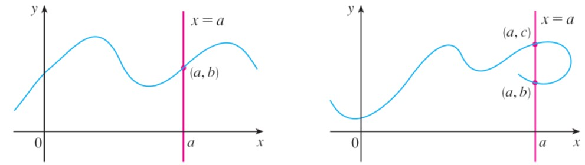

#### Special Function
- Piecewise Defined Function 分段函数
- **Absolute Values** 绝对值
  - $|a+b|\le|a|+|b|$
  - $|a-b|\ge||a|-|b||$
- **Algebraic Functions** 
  - additions, subtraction, multiplication, division, (+、-、*、/) root extraction on **Polynomials**
- **Exponential Functions**
  - 底数大于 0
- **Logarithmic Functions**
  - 底数大于 0
  - 底大图低

#### **Symmetry** (对称性)

- $f(x)=f(-x)$ even function 偶函数
- $f(x)+f(-x)=0$ odd function 奇函数

#### Inverse Functions and Logarithms

- 定义
  - If $x_1\not=x_2 \Rightarrow f(x_1)\not=f(x_2)$
- 判定定理
  - Horizontal Line Test
  - （充要条件） no horizontal line intersects its graph more than once.
  - 反函数必要条件
- 反三角函数
  - 截取三角函数一个单调区间
  - 对于 $\sin$
    - 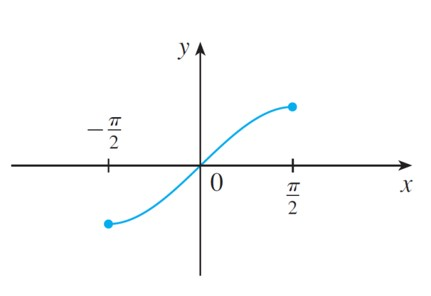
  - 对于 $\cos$
    - 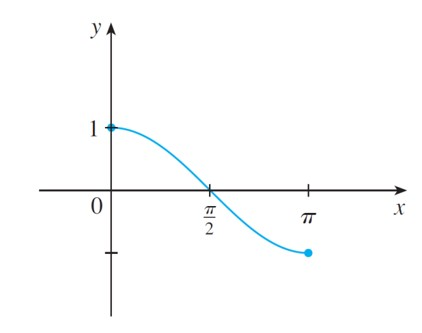
  - 对于 $\tan$
    - 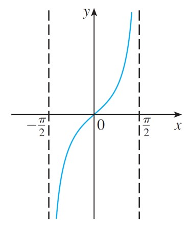
  - 反三角函数图像
    - $\arcsin$
      - 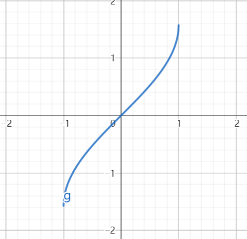
    - $\arccos$
      - 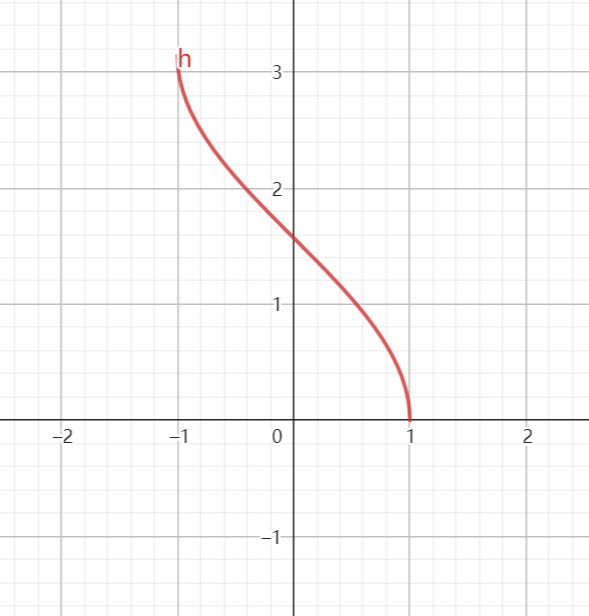
    - $\arctan$
      - 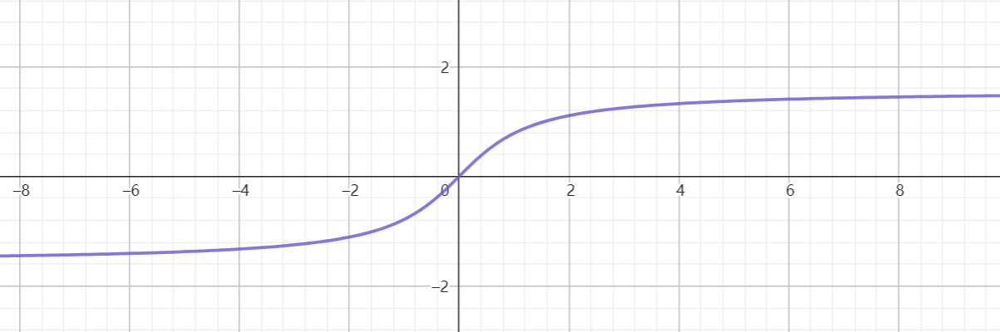

## CHAPTER 2 LIMITS AND DERIVATIVES

### Definition of Limit

Suppose（假设） that $f(x)$ is defined when $x$ is *near* the number $a$. We write
$$
\lim_{x\to a}f(x)=L
$$
if we can make the values of $f(x)$ arbitrarily（任意） close to $L$ by restricting $x$ to be sufficiently close to $a$ (on either side of $a$) but *not equal* to $a$.

#### 单边极限

$\lim_{x\to a^+}f(x)$

$\lim_{x\to a^-}f(x)$

$\lim_{x\to a}f(x)=L$ 当且仅当 $\lim_{x\to a^-}f(x)=L$ 且 $\lim_{x\to a^+}f(x)=L$

#### The Heaviside function

$$
H(x)=\begin{cases}
0&\mbox{if } x<0 \\
1&\mbox{if } x \ge 0
\end{cases}
$$

#### 高斯取整函数

小于等于 $x$ 的最大整数（对于正数来说 就是 整数部分）

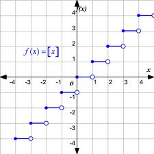

#### **Intuitive Definition of an Infinite Limit**

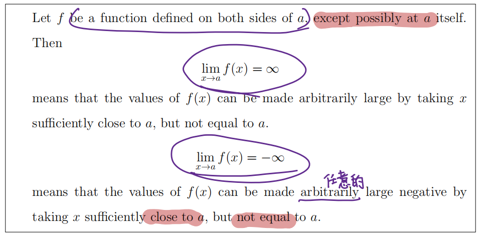

#### **Vertical Asymptotes**（垂直渐近线）

$\lim_{x\to a}f(x)=$ 无穷

#### Limit Law

需要保证极限存在

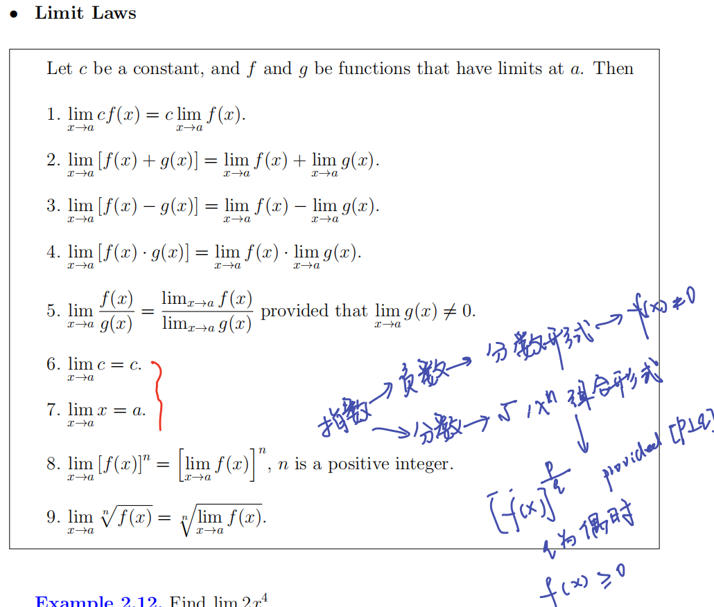

#### Substitution Property

- 对于多项式函数、分式函数（当 $f(x)$ 在 $a$ 处有定义） $\lim_{x \to a}f(x)=f(a)$

- $\forall x \in \mathbb{I}/\{a\}\ \ f(x)=g(x)$  $\lim_{x \to a}f(x)=\lim_{x \to a}g(x)$

- 类似的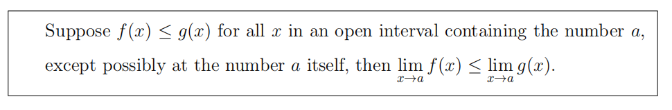

- Some limits are best calculated by first finding the **left-** and **right-**hand limits.
- ***夹逼定理*** 这个是真的重要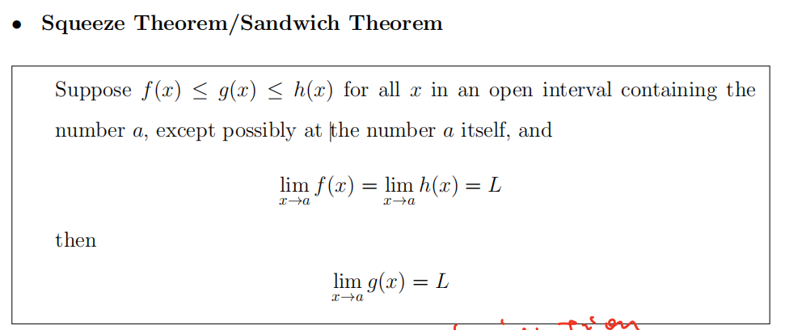

#### 连续性	

##### 在单点处连续

- $\lim_{x \to a}f(x)=f(a)$

  - 极限存在

  - $x=a$ 处有定义

  - 相等

##### 在闭区间上连续

- $f(x)$ 在 $(a, b)$ 连续
- $\lim_{x \to a^+}f(x)=f(a)$ (右连续)
- $\lim_{x \to b^-}f(x)=f(b)$  (左连续)

#### **Composite Limit Theorem**

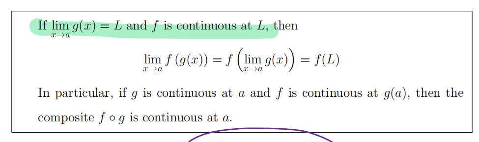

外面连续，里面存在。

#### **Intermediate Value Theorem**

$f(x)$ 在 $[a, b]$ 上连续，在 $[f(a), f(b)]$ 中的所有值，$f(x)$ 都能取到

#### **Horizontal Asymptotes** （水平渐近线）

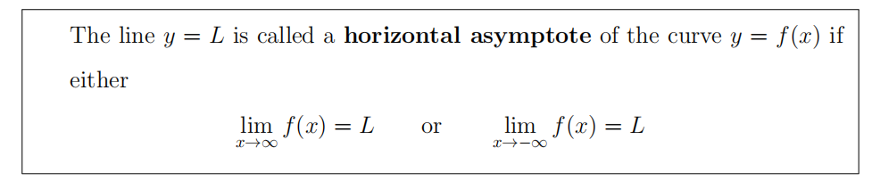

#### 可导一定连续，连续不一定可导

- corner
- Vertical tangent.
- A discount inunity.

## **CHAPTER 3 DIFFERENTIAL RULES**

