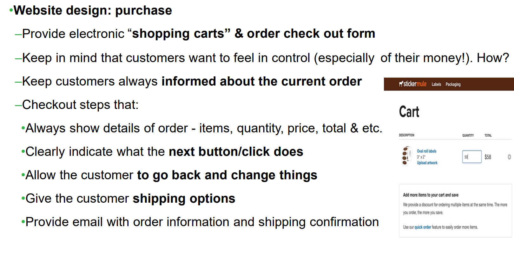
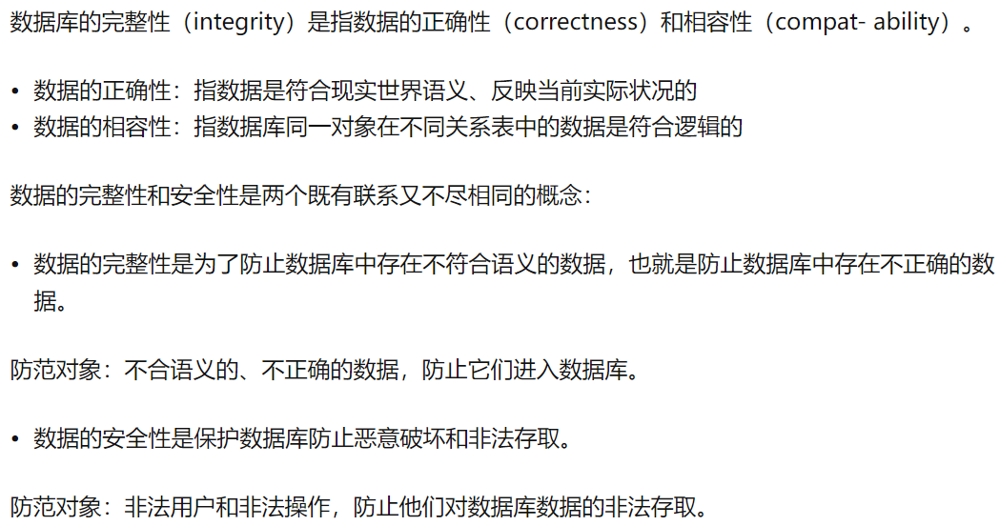

## Chapter 12

### E-commerce

#### （优势）business objective or problem to solve 

- Broadening the customer base(扩大客户群)
- Recapturing customers lost to online competitors (重新夺回输给在线竞争对手的客户)
- Serving existing customers better 
- Integrating departments of existing business (整合现有业务部门)

#### （问题）Issues of Moving Online

- Risks of moving online
  - (同样的客户)Same customers moving from in-store to online 

  - (新的线上竞争) Facing new competition online 

  - (客户不想线上)Existing customers don’t need/want online store 

  - (员工问题)Employee concerns

- costs of moving online
  - (计算机设备)Computer equipment and infrastructure
  - (用人问题)Hiring personnel to manage the website
  - (法律顾问)Legal expertise required to protect your intellectual property, regulations online, and customer privacy

#### （方法）Way to move online

- （设计网站，雇佣ASP）Design website in-house or hire an ASP (Application Service Provider)
- （买\租设备）Buy or lease equipment
- （用现有的软件）Use existing software or have custom software written

#### （组成部分）The Major Components of Ecommerce

- Customer transaction overview
- Order fulfillment

#### STEPS

##### 1. Let customers to your website

- (做广告)print adverstising with URL

- (注册域名)register domain names
    - ICANN (Internet Corporation for Assigned Names and Numbers)
    - An obvious domain name (home page is URL)

- (搜索引擎优化)Search engine optimization
    - pay for a “sponsored link”

- (友链？)Presence on a portal (website about a topic) with links to retail, wholesale, and informational websites
  - ???

##### 2. Identify return customers and personalize the site
- (需要登录)Require the user to register and log in
  - 与数据库建立联系

- (留下cookie) Leave a cookie on the user’s computer
  - （关于用户的信息）Small text file containing information about the user
  - （用户搜索推荐）Suggest similar items a customer searched
    - cookies enable a customer to put items into his or her online shopping cart and return at a later time

  - （提供激励回头客信息）Provide incentives and benefits for return customers—product support for items already purchased, special promotions

##### 3. Provide a secure environment for making a purchase

- （加密）Encryption

  -  ensure sensitive information is encrypted for transmission

- （验证）Authentication

  - verify that your website is legitimate

- （？？）Display a visual seal assuring the customer that the site has been authenticated and meets high security standards？？

##### 4 dan 5. Payment Processing

- OPTION 1（线**上**支付）
  - （STEP4）Online form communicates with accounting software
  - （STEP 5）
    - Accounting system verifies customer credit
    - Customer can correct bad information
    - No need to keep credit card numbers – for security
- OPTION 2 （线**下**支付）
  - （STEP4）Record the order and payment information
  - （STEP5）
    - Verify and complete the transaction offline 
    - Send email confirmation to the customer

##### 6-9 Fulfill the order

- （和线上仓库交流）Communicate with online inventory 
  - （清点库存）Reduce item counts for purchased items 
- （分配运输）Arrange for shipping 
  - （在线运送系统）Online shipping system 
  - （外包运输公司）External shipping company 
- （仓库清点 + 运输到客户）Arrange pick-up at the warehouse and delivery to the customer

#### Designing Your Website

- overall

  - （展现产品吸引力）Attractive with new products displayed

  - （好的设计原则）Good design principles

  - （按照自然购物习惯组织）Organize for natural shopping habits
    - （便于导航）Make it easy to navigate
      - （site map + 导航栏）Provide site map or navigation bar 
      - （去一个页面不要超过四次点击）No more than four clicks from one page to another

  - （鼓励浏览和针对性搜索）Encourage browsing and targeted searching

  - （兼容性）Ensure the site works on different platforms and browsers

- purchase
  - 

- other information
  - （FAQ）FAQ page and link to customer service
  - （）Entries allowed for customer reviews or forums
  - （新闻发布）News and press releases
  - （绑定社交媒体）Links to your social media sites

#### （多系统互联）Multiple software systems 

- overall

  - Website, accounting, inventory, and shipping 

  - Suppliers, orders, and billing 

  - Personnel/human resources software for employees’ payroll, insurance, Social Security, etc…

- Legacy system/code(????)existing old software still in use

- （中间件）Middleware

  - software to enable separate systems to communicate
  - Middleware translates between incompatible（不兼容） data representations, file formats, and network protocols（协议） to allow otherwise disparate systems to exchange information（交换信息）.

- Disaster recovery strategy（容灾策略）

  - response to natural disasters（自然灾害）, equipment failures, or being hacked

#### Other Ecommerce models

- eBay: peer-to-peer auction-style sales
- Craigslist: peer-to-peer classified ads 
- Groupon: group coupons 
- Businesses post coupons for one day only 
- Minimum number required 
- PayPal: online payment service 
- Apple Pay and similar system: mobile payment systems 
- Bitcoin: virtual currency

### Databases

#### 简介

Databases store large amounts of data

#### 用途

- Inventory (names, quantity, etc.) 
- Personnel/Employees (names, addresses, pay rates, Social Security numbers, etc.) 
- Customers (names, addresses, products, orders, credit, etc.) 
- Suppliers (names, addresses, products, orders, etc.) 
- Financials (sales, expenses, taxes, etc.)

#### Database management system (DBMS)

(创建和管理数据库)It is a software program that enables the creation and management of databases.

Relational Database Management System (RDBMS)（关系型数据库）

常见关系型数据库

- Microsoft Access 
- Microsoft SQL Server
- MySQL
- Oracle

#### 概念

##### table

- is a collection of related records regarding an entity.

##### Tuple

- a technical term for row or record of a relational table
-  represents a set of related data.
- 相似概念：tuples/records/rows.

##### Attributes（字段）

- 属性 ，列，数据类型

##### [Attribute domains （属性域）](https://pro.arcgis.com/zh-cn/pro-app/latest/help/data/geodatabases/overview/an-overview-of-attribute-domains.htm)

- （描述字段合法值的规则）rules that describe the legal values of a field type
- （约束）constrain the values allowed in any particular attribute for a table.

##### Data type 

- Data type ensures that all the data in a column is entered using the same format.

##### Field size

- Field size are the amount of space reserved for storing data

##### Primary key

- attribute(s) that uniquely identify a tuple/record
- 原则
  - 每个表只能定义一个主键
  - unique for each record（唯一性原则）
  - must not contain any nulls (non-values)（非空）
- 解决办法
  - 新建一个字段，使用 computer generated unique number
  - Auto Increment data：
    - unique employee ID
    - assign to each employee record when they’re created.

##### Foreign keys

- provide a link to another table.

- create relationships

- flexibility to extract data from different tables.

- 综述

  - Relationships are the very core of relational databases.（关系是 Relational Database 的核心）
  - The primary key, together with the closely related foreign key concept, are the main way in which relationships are defined. （外键是定义关系的核心）
  - Relationships allows description of the connections between different database tables in powerful ways.（外键可高效描述不同表之间的联系）
  - 表关系查询可以使用 cross-table queries, known as **joins**

- 三种外键形式

  - One-to-one relationships

    -  rarely used 
    - more efficient to simply put all of the information in a single table.

  - One-to-many relationships

    - Each record in the first table corresponds to one or more records in the second table （第一张表中的记录，关联到第二张表中**一个/多个**记录）
    - but each record in the second table corresponds to only one record in the first table（第二张表中的记录，关联到第一张表中**一个**记录）

  - Many-to-many relationships

    - 第一张表中记录 对应 第二张表很对记录

    - 第二张表中记录 对应 第一张表很对记录

    - You cannot set up a many-to-many relationship directly between two tables.（不能直接在两个表之间建立）

    - A join/intermediate table, Enrollments, creates two one-to-many relationships— one between each of the two tables.（建立一个额外的表维护表关系）（这个表中的记录和原来两个表之间都有one-to-many relationships）

      

##### [Database integrity](https://baike.baidu.com/item/%E6%95%B0%E6%8D%AE%E5%BA%93%E5%AE%8C%E6%95%B4%E6%80%A7/4928215?fr=aladdin)

[引用自](https://zhuanlan.zhihu.com/p/374257212)

包括如下方面：

- （实体完整性）Entity integrity：no primary key can be missing（无主键缺失）

- （数据完整性）Data integrity：values must match category constraints（值匹配类型约束）

- （**参照完整性**）Referential integrity：foreign keys must match a primary key value in the related table（外键必须匹配对应主键）

  enforces the following three rules:

  - The Order’s FK attribute must points to a valid record in the Customer table（外键指向合法有效记录）
  - If the primary key for a record in the Customer table changes, all corresponding records in the Order table must be modified using a cascading update（被指向的记录发生更改时，指向它的记录应该被更新）（**级联更新**）
  - If a record in the Customer table is deleted, all corresponding records in the Order table must be deleted using a cascading delete.（被指向的记录删除之后，指向他的记录**必须删除**？？？）

#### 原则

- 
