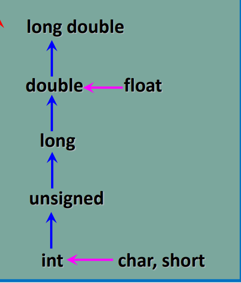
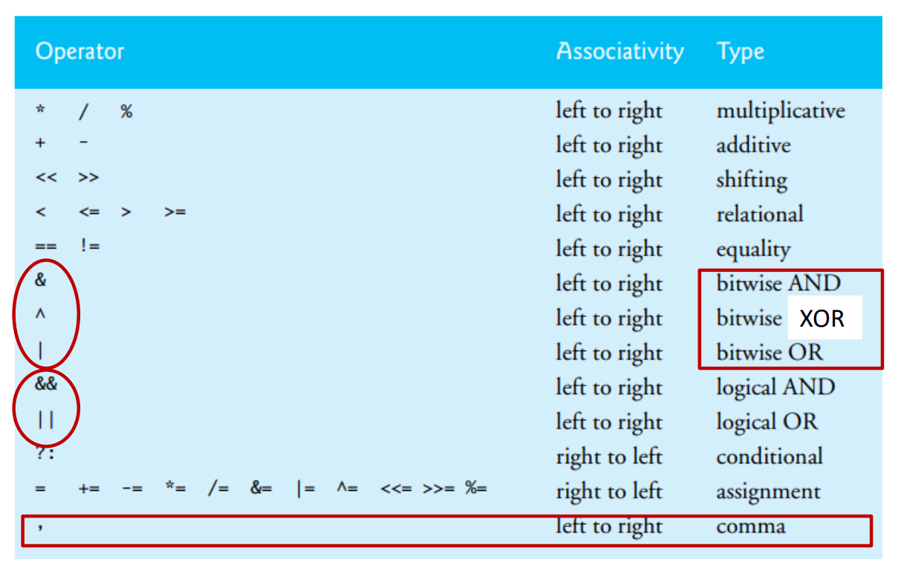

## Programming Language C

### 19/9/2022 (week 1)

- 1972 by Bell Lab.
- `\n` means *newline* or *return*

### 20/9/2022 (week 2)

#### About Escape sequence

- `\b` means backspace. It **can not delete** the last character, just **move the cursor one position back**, and the next character will overwrite it. if `\b` is the last character its effect won't be display.

- `\t` move cursor to the next **tab stop**

- [`\n` and `\r`](https://stackoverflow.com/a/15433263)

  - **`\n` (Line Feed)** → moves the cursor down to the next line without returning to the beginning of the line *— In a \*nix environment `\n` moves to the beginning of the line.* In *nix for new line
  - **`\r` (Carriage Return)** → moves the cursor to the beginning of the line without advancing to the next line
  - **`\r\n` (End Of Line)** → a combination of `\r` and `\n` — In windows for new line.

- `\f` `\v` ???

- `\0`

  - ```c
    #include <stdio.h>
    #include <stdlib.h>
    
    int main()
    {
        printf("abcabcabc\0abcabcabc"); // translate into '\0'
        printf("\n");
        printf("123123\0123123"); // translate into '\012'
        return 0;
    }
    
    ```

- `\nnn` backslash and a octal number is a character. It is the character whose ascii is the number.

- `\xhh` backslash + `h` + a hexadecimal number is a character. It is the character whose ascii is the number.


#### other points

- The remainder operator (%) can be used only with integer operands.
- he operators *, / and % are on the same level of precedence, and the operators + and - are on a lower level of precedence

### 27/9/2022

#### Number System

- prefix
  - Octal: 0
  - Hexadecimal: 0x

-  postfix (for writing)
  - Binary: xB
  - Octal: xQ or xO
  - Decimal: xD or none
  - Hexadecimal: xH
- **exponential form** (**scientific notation**) in  c, the value of it is a float format. 5e3(float)


### 4/10/2022

#### IEEE 754 Standard

##### 通用标准

- 32bits: 1(sign) - 8(Exponent) - 23(Mantissa)
- 64bits: 1(sign) - 11(Exponent) - 52(Mantissa)

##### 分类

- Normalized ($\text{exp} \not= {全是0}\ \text{and}\ \text{exp} \not= \text{全是1}$)
  - (**忽略头部1**)忽略小数点前面的 1 ，只记录尾数
  - (**注意偏执量** $\sigma$) $32$ bits: 形式指数 - 127($2^7-1$)   = 真实指数 （真实指数小）
  - (**注意偏执量 $\sigma$**) $64$ bits: 形式指数 - 1023($2^{10}-1$) = 真实指数 （真实指数小）
  - $(-1)^{s}\times  1.\text{mantissa} \times 2^{\text{Exp} - \sigma}$
- Denormalized (exp全是$0$)
  - $s=0, E=M=0$ 表示 $+0$
  - $s=1 , E=M=0$ 表示 $-0$
  - $M \not=0$ 表示 $(-1)^{s}\times$ $\color{red}{0}$$.\text{mantissa} \times 2^{\text{Exp} - \sigma}$
- Special Value(exp全是$1$)
  - Nan
  
    - $M\not=1$
  - infinity number
  
    - $M=0$ ，$s$ 表示正负无穷
  
    

#### 表达式

- 强制类型转换运算优先级 （C 风格强制类型转换优先级最高）

####  enumeration constants

```enum { Wed , Tues};```

可以给某些元素赋初值，然后后面的元素会递增。初值 int, long long 均可

#### sizeof

sizeof 返回值是一个 size_t，是一个unsigned int。[sizeof](https://zh.cppreference.com/w/c/language/sizeof)

#### [Two's Complement](https://www.cs.cornell.edu/~tomf/notes/cps104/twoscomp.html)

- a leading 1 means the number is negative, a leading 0 means the number is 0 or positive.
- 正反转换 都是 取反+加一

##### 浮点数(十进制)有效数字（粗略）

- float: 7 - 8
- double: 16 - 17
- long double: 17 - 18

##### 自增自减运算符 [待查](https://zh.cppreference.com/w/cpp/language/operator_incdec)

后增 计算发生在读取的下一刻，而不是语句结束后

[练习](https://l.xmu.edu.my/pluginfile.php/801800/mod_resource/content/1/Chapter2.pdf) P78

##### 数值提升顺序

- `char` 类型和 `short` 类型在进行算术运算时会自动提升为 `int` 类型。类似地，`unsigned short` 类型在进行算术运算时会自动提升为 `unsigned int` 类型。
- `bool` 类型可以提升为整型，`false` 变为 ，而 `true` 对应为 。







[运算符优先级](https://zh.cppreference.com/w/cpp/language/operator_precedence)

[值类别](https://oi-wiki.org/lang/value-category/)

[算术类型](https://zh.cppreference.com/w/c/language/arithmetic_types#.E6.95.B0.E6.8D.AE.E6.A8.A1.E5.9E.8B)
